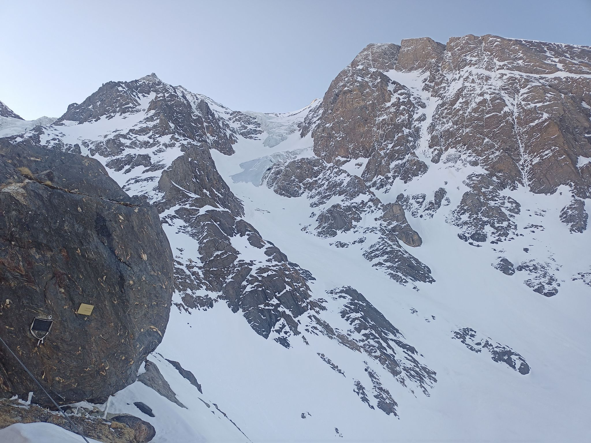
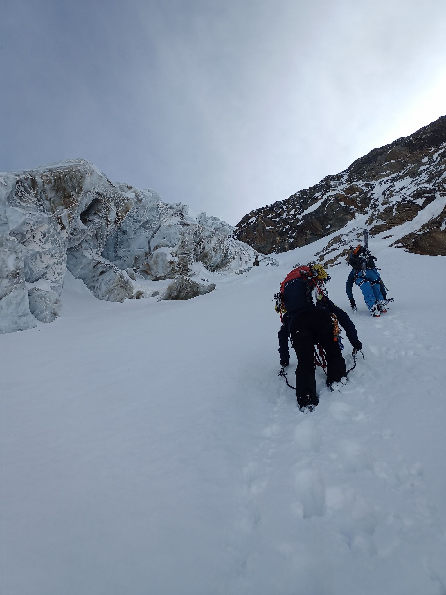
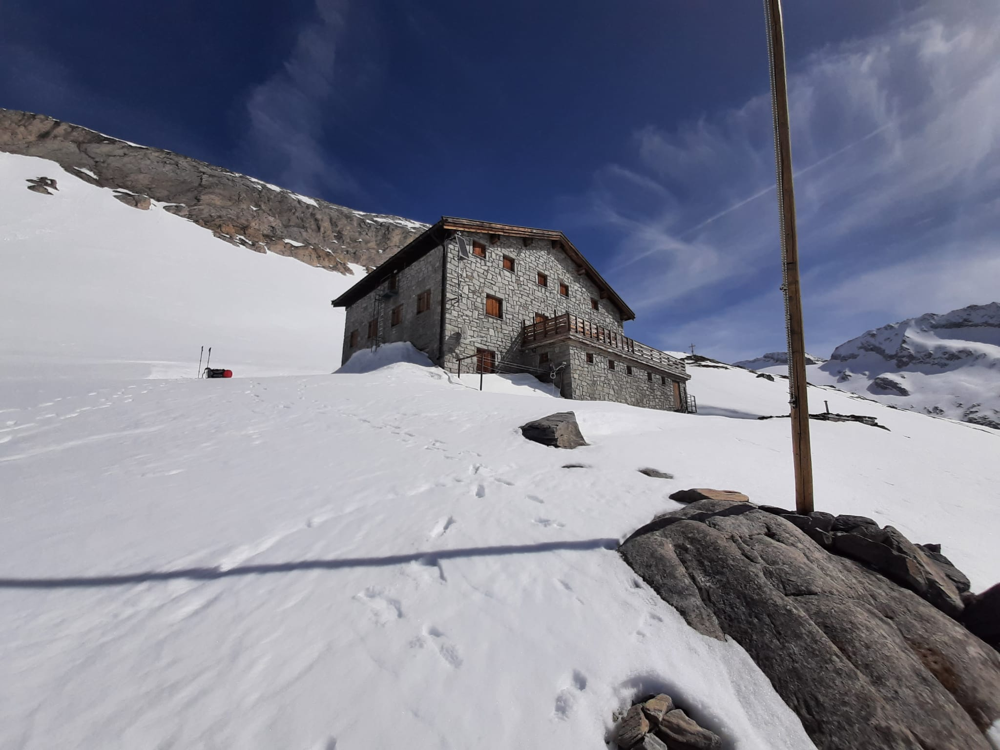
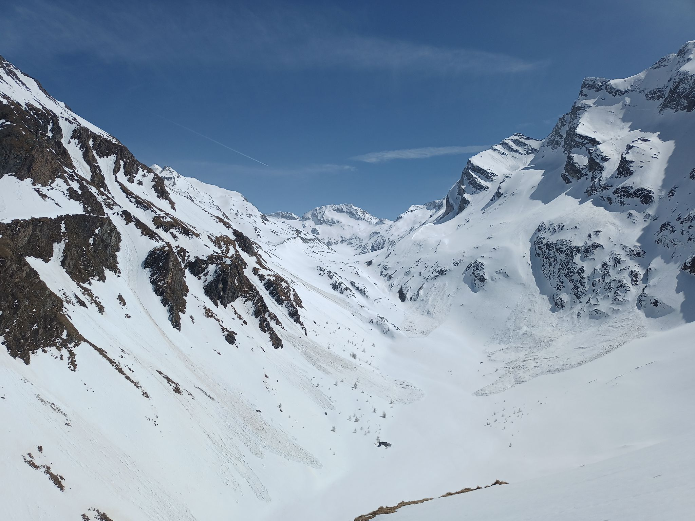

Jaro je v plném proudu, první dubnový víkend se chodí na Prigl v plavkách a my se vydáváme vylézt severku na Hochferner (3470 m n.m) v Zillertalských Alpách, u hranice Rakouska s Itálií. Já a Barča jedeme z Brna, autor nápadu Jean jede z Prahy a má se k nám připojit v Linzi; chvíli před odjezdem mi ale volá, že vlak ČD neměl ani pět minut zpoždění, čili mu ujel. Rychle hledám alternativní spoje a naštěstí hned jede další do Budějic, takže to jen bereme o něco delší trasou.
Původní plán byl přijet pod kopec mezi osmou a devátou, hodit batoh na záda a o půlnoci už chrnět v Günther-Messner bivaku, ale úzkou lesní cestou za Steinem projíždíme až někdy před desátou. Ve výšce 1580 m nás zastavuje hluboký, rozbředlý sníh - dost na to, aby žabička už neprojela, ale na lyže to zase po pár metrech není. Špekulujeme, jestli je fakt tahat na zádech, nebo to jít v pohorkách, ale já jsem si naštěstí vzal jen přezkáče. Někteří ještě přebalují batohy, za námi přijíždí další dvojice (s jiným cílem) a z vrchu schází dva, co byli lozit led na Hochferneru - skoro bych řekl, že v tuhle noční dobu je tady celkem rušno. Máme trochu obavu, jestli se vlezeme do bivaku, ale prý tam nikdo není, jenom je zevnitř zafoukaný sněhem a budeme to muset vykopat.
Už ve třičtvrtě na jedenáct začínáme šlapat a po chvíli přelézat padlé stromy, které přehrazují trochu se ztrácející pěšinu. Most přes potok ale nakonec najdeme, a po pár stech metrů už jde jít na lyžích. Zanedlouho je to i nutnost - na loukách nad lesem bychom se v mokré kaši propadali po pás. Stoupání je mírné, ale v tuhle hodinu bychom už přece jen raději leželi ve spacácích - do bivaku se však dostáváme až po téměř 4 hodinách. Naštěstí to s tím zafoukáním není tak zlé, některé postele jsou suché - předchozí ubytovaní zapomněli zavřít okno.
Před sedmou vstávám, abych začal roztápět sníh. Jsme ve výšce 2528 metrů, ale je tu docela teplo a za chvíli zjišťuju, že nedaleko i teče z pod sněhu potok. Od bivaku je krásný výhled na naši cestu až po horní část odhaleného ledovce.

Po zabalení traverzujeme na mačkách do protisvahu a kličkujeme mezi skalami. Občas je tu nafoukáno a musíme se nahoru dost hrabat. Za skalami už je krusta lepší, ale zjišťujeme, že s těžkým batohem s lyžemi a bez aklimatizace to moc nešlape - Jeanovi nedoléčený černý kašel taky neprospívá. Suneme se tak nahoru neskutečně pomalu, každých pár kroků oddychujeme. První odhalený led obcházíme zleva, na druhém po příchodu odpaňuju svůj hliníkový šroub, ale nakonec kvůli úspoře času raději šplháme co nejvýše zprava po sněhu. V asi 40° svahu se boříme, ale na lyžích to není o moc lepší - buď kloužou po umrzlé krustě, nebo ujíždějí v cukříku. Led nad námi ale tvoří nádherné krajky.

Terén začíná být trochu exponovanější a čeká nás krátký výšvih po glazuře, tak vytahujeme i lano. Má smysl opravdu jen pár metrů; poté pokračujeme zase nekonečným šlapáním. Každých pár metrů se opírám o cepíny zapíchnuté napříč a funím. Už jsem zmiňoval, jak jsou ty svině na zádech těžké?
Po nějaké době zkontrolujeme mapu a koukáme, že jsme si nad ledem zvolili poněkud špatný směr; místo na Hochferner stoupáme spíše na Hinterer Weißspitz. Svah, kterým jsme měli stoupat, se nám ale moc nelíbí - na rozdíl od našeho je osluněný a jak posloucháme celé odpoledne laviny sesouvající se z jižních svahů, jít za sluníčkem nás neláká. Raději bychom přešli na Hochferner až po rovném hřebínku… Sestupuje se totiž opačnou stranou Hochferneru na celkem plochý ledovec bez trhlin, po kterém bychom už měli být schopni sjet na lyžích až k Hochfeilerhuette. Bohužel v naší části hřebene jsou svahy prudké, téměř neschůdné.

Na hřebeni jsme až v sedm večer, a poměrně dost vyčerpaní. Uvažujeme, jestli to raději nesejít známým terénem po vlastních stopách - na lyžování prudkého svahu si už v tomhle stavu netroufám a Barča je na tom na lyžích ještě hůře. Volíme tedy postup  po hřebeni, navázáni na laně. Hřebínek  je ale v následujícím úseku docela ostrý - bojím se, že takhle unavení uděláme nějakou chybu a nedopadne to dobře. V posledních slunečních paprscích Jean kouká na jižní stranu a má pocit, že by to tudy šlo. Po tmě to tedy zkoušíme rovnou dolů - pevně se usadím a jistím sestupujícího Jeana do těla. Když dojde na konec svázaných lan, nachází ve skalním pásu hrot, za který by šlo slanit. Barča ho pak následuje s prusíkem, já sedím sám na hřebeni ve 3400, koukám na tmavé hory okolo osvětlené jenom jasnými hvězdami a připadám si skoro romanticky. Pak pustím lano dolů, aby mě nestahovalo, a scházím po stopách.
Hrot není za mě úplně ideální, ale když smyčku hlídáme, dá se. Když přicházím ke štandu, Jean bojuje někde níže s koncem lana zaseknutým ve skalách, a nakonec ho musí cepínem přeseknout. Stejně tady ta lana musíme nechat - zkrácená nevyjdou až úplně dolů, ale pod koncem lana už nejsou zásadní obtíže. Za světla by to možná šlo opatrně obejít, ale slézat rozbitým mixem za tmy bez jištění by bylo asi dost nezdravé na pleť.
Někdy okolo půlnoci jsme tak na ledovci Weißkarfener, nazouváme lyže a vydáváme se na druhou stranu, kde nás za muldou čeká už jenom sjezd. Ten je nakonec celkem pěkný - sníh je krásně rovný, umrzlý do tvrda a svahy jsou široké a nijak moc prudké. Jen občas objíždíme laviniště z něčeho, co tady odpoledne vypadlo - možná dobře, že jsme tady až teď. Bára raději jde pěšky, unavené nohy už moc neposlouchají a nechce si zlomit nohu.
Na Hochfeilerhuette dorážíme asi o půl druhé, do tří pak ještě roztápíme sníh, abychom uhasili žízeň po celém dni. Říkám si, že takový malý Hochferner by šlo dělat i v Brně, přijít domů ve dvě ráno, totálně na kaši a o několik tisíc chudší. Budíček tentokrát nedáváme a tak baštíme brunch až někdy po desáté ráno.

Sjezd od chaty dolů je za odměnu - horní dva centimetry roztopené, žádná divočina. Dojedeme až na placaté dno údolí, které pak pokračuje neschůdnou soutěskou. Nasazujeme pásy a stoupáme žlebem po levici, abychom se napojili na značku od Gliederscharte. Ten je sice severovýchodně orientovaný, v poledne je ale už dost roztopený, tak na něj hledíme s obavami - jinudy však cesta nevede. Při pohledu z vršku si dovedeme představit, že včera odpoledne to okolo asi úplně zdravé nebylo.

Dole v údolí musíme překonat ještě několik lavinišť, občas je v nich více šutrů a hlíny, než sněhu. V lese pak je sněhu čím dál méně - lyže finálně sundáváme kousek pod odbočkou k Gunther-Messner bivaku.
Asi 200 metrů od auta nám zatne, když vidíme, že se proti nám hrabe auto carabinierů. Policajt se ptá, jestli je naše ta zelená dodávka, ale hned nás ujišťuje, že je všechno v pohodě - někdo nahlásil, že je podezřelé, že tam už dva dny stojí opuštěné auto a nahoře v údolí je to divoké. Sami jsou asi rádi, že nemusí nic vyšetřovat, už jenom na těch sto metrech ve sněhu si evidentně spálili spojku. Opisují si všechny údaje včetně velikosti spodního prádla a odjíždí, a my za chvíli taky.

Radim